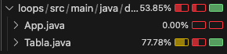

## Tabla de multiplicar
Este proyecto es una pequeña aplicación Java que genera la tabla de multiplicar del número 3. El código está diseñado con un enfoque funcional y orientado a pruebas, utilizando una clase estática para la generación de la tabla y pruebas unitarias con JUnit y Hamcrest para verificar su correcto funcionamiento.

### 📋 Requisitos
- Java 8 o superior.
- Maven o Gradle para la gestión de dependencias.
- JUnit 5 y Hamcrest para la ejecución y validación de las pruebas.

### 💻 Uso
La clase Tabla.java contiene la lógica principal para generar la tabla de multiplicar. Y TablaTest.java es el archivo de prueba que valida la funcionalidad de la clase Tabla.

### 🧪 Pruebas
Para ejecutar las pruebas unitarias y verificar la cobertura del código, asegúrate de que tu pom.xml incluya las dependencias necesarias de JUnit 5, Hamcrest y JaCoCo. Luego, desde la raíz del proyecto, puedes ejecutar el siguiente comando de Maven para compilar el código y ejecutar las pruebas.

mvn clean test

